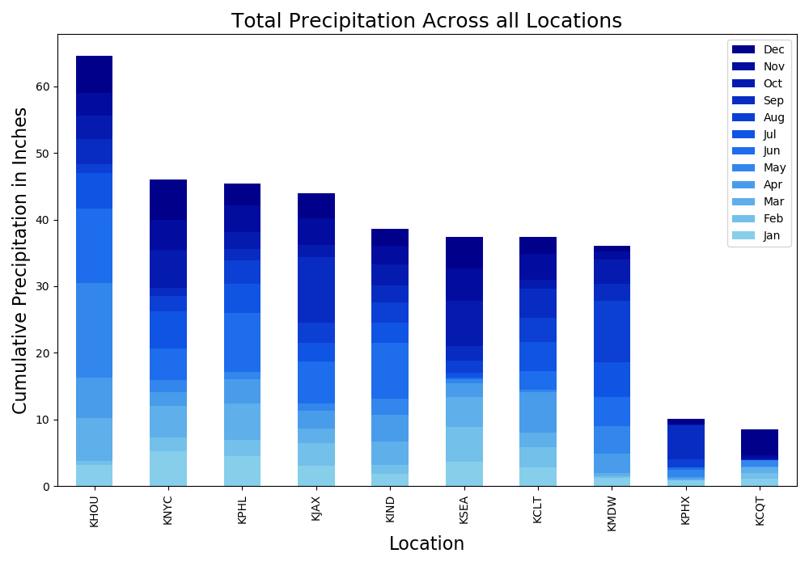
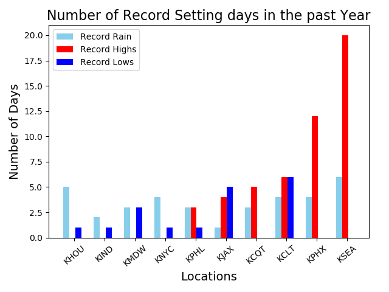
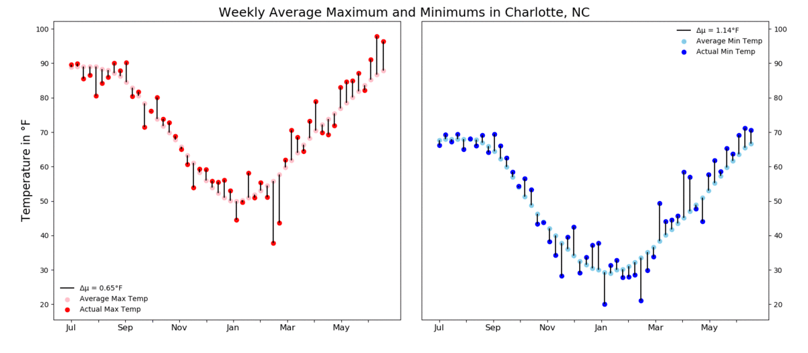

# US Weather

## Initial looks at the data
While looking through the dataset 

# Cumulative Rainfall

When reviewing this graph two things stood out to me. First, Houston (KHOU), received over 60 inches of precipitation over a one year span and more than a foot more than the closest other cities in the dataset. Houston's biggest month of rainfall came in May 2015 which I looked into further and discovered that on memorial day Houston received around 12 inches of rain in the span of ten hours causing $459.8 million in damages, one of the costliest floods in American history.

On the other end of the spectrum I fully expected Seattle (KSEA) to be the leader in this category due to its reputation as the rainy city. However it came fourth, behind Houston, New York (KNYC), Philadelphia (KPHL), and Jacksonville(KJAX). Going further into my analysis I would find that Seattle ended up having a record setting year of heat. (Upon further research I learned that Seattle is known as the rainiest city due to the number of days with rain and not the amount.)

# Historic Weather

Seattle set the most heat records with 25 beating Phoenix(KPHX) at 17 and every other city set records in the single digits. Seattle and Phoenix are joined by LA (KCQT) as the only cities in this dataset to not set a new record low during this time span. 

# Weekly Averages 

Source: [Weather Underground](http://wunderground.com)

[FiveThirtyEight](https://github.com/fivethirtyeight/data/tree/master/us-weather-history)