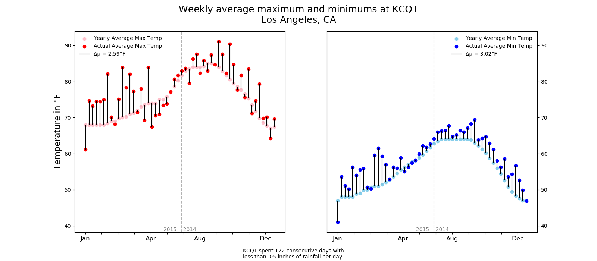
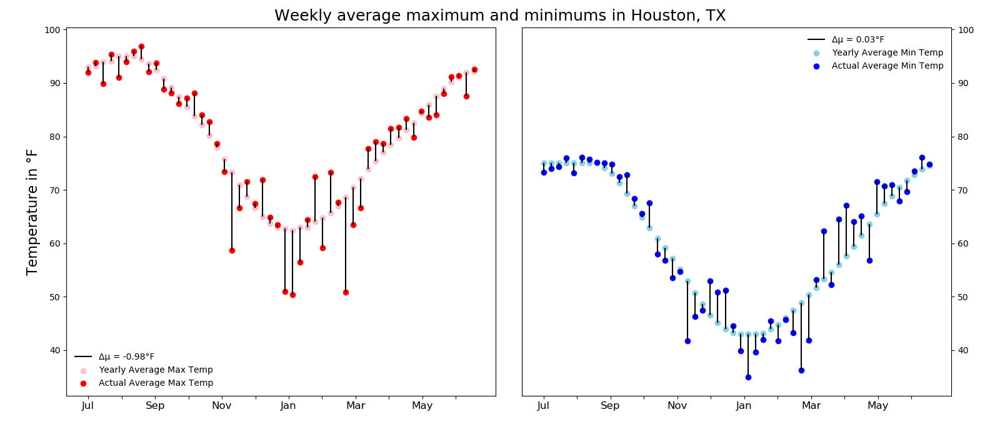
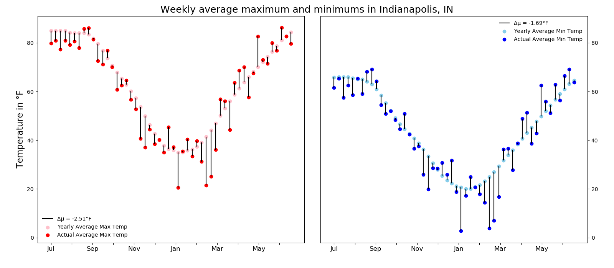
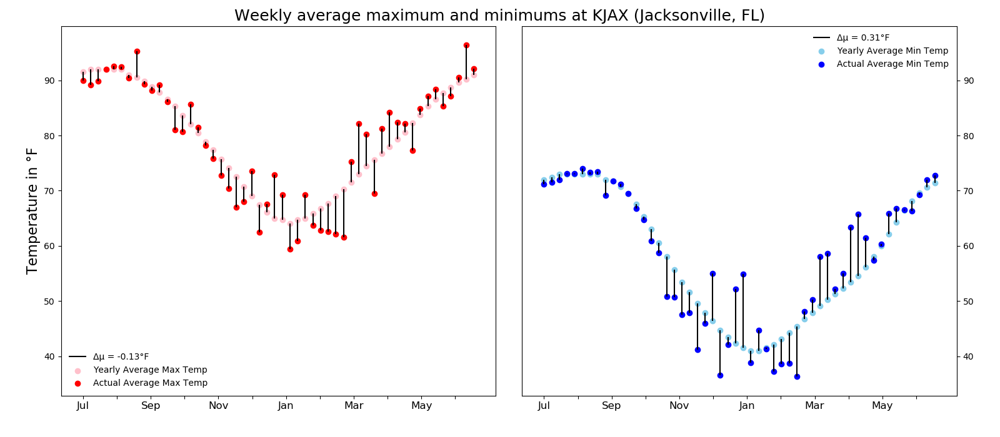
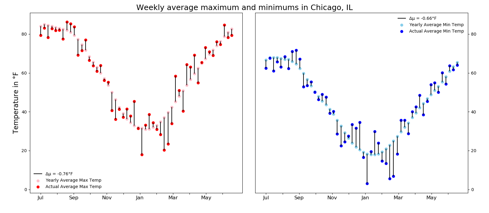
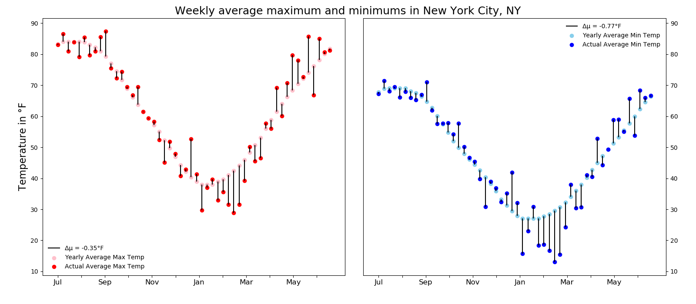
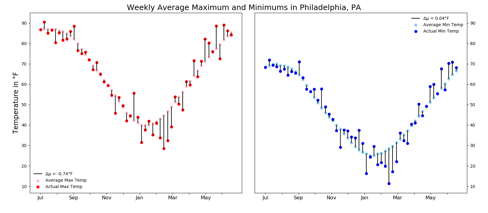
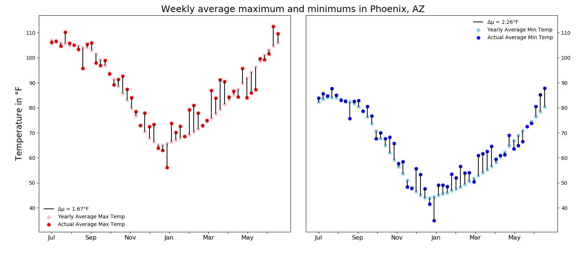
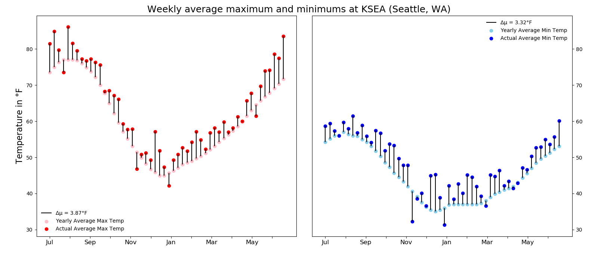

# US Weather Data Analysis

This project analysis weather data pulled from ten cities weather stations.  The data was originally scraped from [Weather Underground](http://wunderground.com) by [FiveThirtyEight](https://github.com/fivethirtyeight/data/tree/master/us-weather-history)

Column | Description
---|---------
`date` | The date of the weather record, formatted YYYY-M-D
`actual_mean_temp` | The measured average temperature for that day
`actual_min_temp` | The measured minimum temperature for that day
`actual_max_temp` | The measured maximum temperature for that day
`average_min_temp` | The average minimum temperature on that day since 1880
`average_max_temp` | The average maximum temperature on that day since 1880
`record_min_temp` | The lowest ever temperature on that day since 1880
`record_max_temp` | The highest ever temperature on that day since 1880
`record_min_temp_year` | The year that the lowest ever temperature occurred
`record_max_temp_year` | The year that the highest ever temperature occurred
`actual_precipitation` | The measured amount of rain or snow for that day
`average_precipitation` | The average amount of rain or snow on that day since 1880
`record_precipitation` | The highest amount of rain or snow on that day since 1880

## Initial looks at the data
While looking through the dataset I found two missing data points, both from the Chicago dataset one each from `record_min_temp_year` and `record_max_temp_year`. I decided to try to find these missing data online but had no luck so i decided to leave it blank for now because techniques such as filling in with the average would not be appropriate in this situation.

All code for graphs can be found under exploratory.py

# Cumulative Rainfall

When reviewing this graph two things stood out to me. First, Houston, received over 60 inches of precipitation over a one year span and more than a foot more than the closest other cities in the dataset. Houston's biggest month of rainfall came in May 2015 which I looked into further and discovered that on memorial day Houston received around 12 inches of rain in the span of ten hours causing $459.8 million in damages, one of the costliest floods in American history.

On the other end of the spectrum I fully expected Seattle to be the leader in this category due to its reputation as the rainy city. However it came fourth, behind Houston, New York, Philadelphia, Indianapolis, and Jacksonville. Going further into my analysis I would find that Seattle ended up having a record setting year of heat. 

(Upon further research I learned that Seattle is known as the rainiest city due to the number of days with rain and not the amount.)

The code for this graph can be found under:

    graph_rainfall

For this graph I started with a single location in a dataframe which I grouped by the month. I then did the same for the rest of the locations appending it to the end of the original dataframe. I then took this large dataframe and turned it into a pivot table with the information I needed for the graph. Using pivot table functions I was able to sort the total values from largest to smallest. Finally I created the color gradient and changed the order of the legend to match the order seen on the graph.

# Long periods without Precipitation 

LA , while is in a desert, having less than ten inches of total rainfall struck me as odd, digging further I found that LA had 122 consecutive days where the precipitation was less than 1/20th of an inch with the next closest in Phoenix at less than half the duration. Indy only reached a maximum of 18 consecutive days without significant rainfall, the lowest of all ten cities.

The code for this graph can be found under:

    graph_longest_drought

In making this visualization I first used a list comprehension that looped through the datasets and called my function `longest_drought` which creates an accumulator which looks at the actual precipitation and updates if it is below the threshold. This data is then loaded into a dataframe, sorted and plotted.

# Historic Weather

Seattle set the most heat records with 20 beating Phoenix at 17 and every other city set records in the single digits. The rainy city lived up to it's name with the most days of record setting precipitation.

The code for this graph can be found under:

    graph_records

To create this graph I created masks for the dataframes to look at when the current year matched the year of the record. Due to the missing data in the Chicago dataset I also added another comparison to compare the actual high and lows to the record high and lows. I applied the same strategy of comparing actual to the record to obtain the number of days of record rainfall. However, with just that mask LA had a surprising number of "rainfall record", I looked further into this and saw quite a few instances of 0" as the record precipitation. With that in mind I added a check to see if the record precipitation was not zero.

# Weekly Averages 
After seeing the number of records set in the timespan of the dataset I wanted to look at each city closer and see how different 2014-2015 was when compared to the average year in the city.

Seattle had an extremely warm year with the average high 3.87°F warmer than years before and lows following suit averaging 3.32°F higher than previous lows.

LA came in as a close second with highs 2.59°F higher and lows 3.02° warmer.

Indianapolis had a colder year than average with highs 2.51°F colder and lows averaging 1.69°F lower than their average year. 

The code for this graph can be found under:

    avg_max_min_graph

Finally, these graphs were created by first loading in the data, creating a new column corresponding to the week and grouping the data into these 52 rows to obtain the weekly averages. Using my function `get_change_in_average` I was able to calculate both the historical and the actual averages and find the difference. In order to visualize this data correctly I needed to create an adjusted week value to graph due to the datasets starting in the middle of the year, without this adjustment the graph would begin in January 2015 and end December 2014 which would cause confusion. Now that the data are in the correct order I plotted the historical high and low weekly averages followed by the dataset's actual weekly averages. In order to better visualize the difference in these points I added vertical lines starting at the historical average and stopping at the actual average. Changing the X-axis tick marks to represent months instead of weeks and adding tick marks and labels to the right side of the second plot helped to create better clarity.

# Sources 

[Weather Underground](http://wunderground.com)

[FiveThirtyEight](https://github.com/fivethirtyeight/data/tree/master/us-weather-history)

# Appendix

