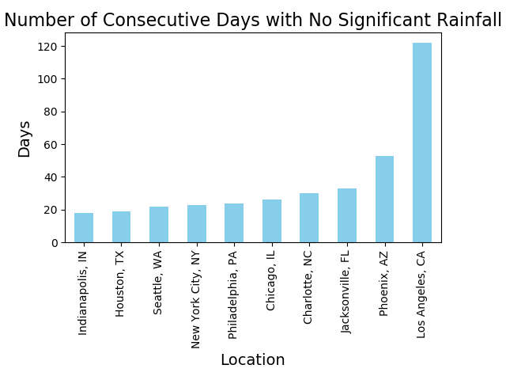

# US Weather

## Initial looks at the data
While looking through the dataset 

# Cumulative Rainfall

When reviewing this graph two things stood out to me. First, Houston (KHOU), received over 60 inches of precipitation over a one year span and more than a foot more than the closest other cities in the dataset. Houston's biggest month of rainfall came in May 2015 which I looked into further and discovered that on memorial day Houston received around 12 inches of rain in the span of ten hours causing $459.8 million in damages, one of the costliest floods in American history.

On the other end of the spectrum I fully expected Seattle (KSEA) to be the leader in this category due to its reputation as the rainy city. However it came fourth, behind Houston, New York (KNYC), Philadelphia (KPHL), Indianapolis (KIND) and Jacksonville(KJAX). Going further into my analysis I would find that Seattle ended up having a record setting year of heat. (Upon further research I learned that Seattle is known as the rainiest city due to the number of days with rain and not the amount.)

# Long periods without Precipitation 

LA (KCQT), while is in a desert, having less than ten inches of total rainfall struck me as odd digging further I found that LA had 122 consecutive days where the precipitation was less than 1/20th of an inch with the next closest in Phoenix (KPHX) at less than half the duration. Indy only reached a maximum of 18 consecutive days without significant rainfall, the lowest of all ten cities.

# Historic Weather

Seattle set the most heat records with 25 beating Phoenix at 17 and every other city set records in the single digits. 

# Weekly Averages 
After seeing the number of records set in the timespan of the dataset I wanted to look at each city closer and see how different 2014-2015 was when compared to the average year in the city.

Seattle had an extremely warm year with the average high 3.87°F warmer than years before and lows following suit averaging 3.32°F higher than previous lows.

LA came in as a close second with highs 2.59°F higher and lows 3.02° warmer. However, LA spent 122 consecutive days without significant rainfall.

Indianapolis had a colder year than average with highs 2.51°F colder and lows averaging 1.69°F lower than their average year. 

Sources: [Weather Underground](http://wunderground.com)

[FiveThirtyEight](https://github.com/fivethirtyeight/data/tree/master/us-weather-history)