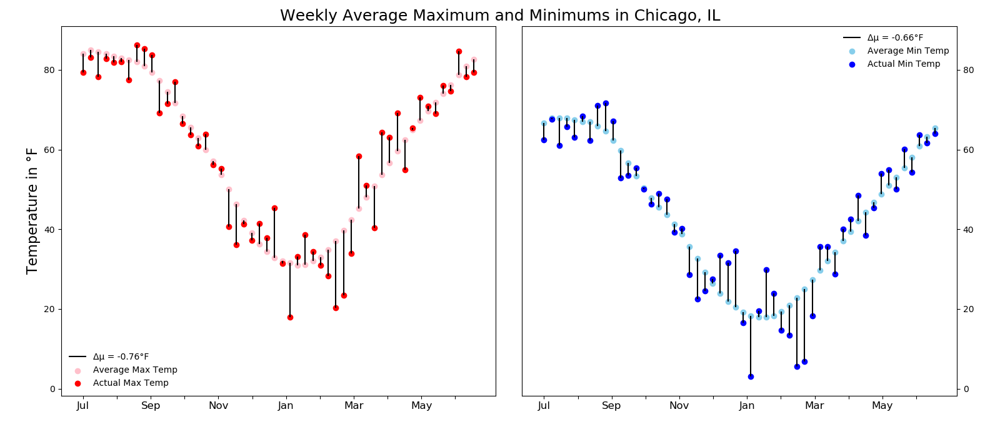
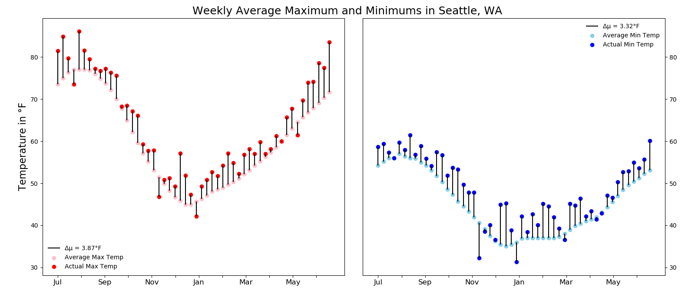

# US Weather Data Analysis

This project analyzes weather data pulled from ten city's weather stations.  The data was originally scraped from [Weather Underground](http://wunderground.com) by [FiveThirtyEight](https://github.com/fivethirtyeight/data/tree/master/us-weather-history)

Column | Description
---|---------
`date` | The date of the weather record, formatted YYYY-M-D
`actual_mean_temp` | The measured average temperature for that day
`actual_min_temp` | The measured minimum temperature for that day
`actual_max_temp` | The measured maximum temperature for that day
`average_min_temp` | The average minimum temperature on that day since 1880
`average_max_temp` | The average maximum temperature on that day since 1880
`record_min_temp` | The lowest ever temperature on that day since 1880
`record_max_temp` | The highest ever temperature on that day since 1880
`record_min_temp_year` | The year that the lowest ever temperature occurred
`record_max_temp_year` | The year that the highest ever temperature occurred
`actual_precipitation` | The measured amount of rain or snow for that day
`average_precipitation` | The average amount of rain or snow on that day since 1880
`record_precipitation` | The highest amount of rain or snow on that day since 1880

## Initial Look at the Data
While looking through the dataset, I found that two data points,`record_min_temp_year` and `record_max_temp_year`, were missing for the city of Chicago. An initial search for these data points was not fruitful, so they are currently blank for now because techniques such as filling in with the average would not be appropriate in this situation.

All code for graphs can be found under [exploratory.py](https://github.com/AJWyman1/us_weather/blob/main/exploratory.py)

# Cumulative Rainfall

When reviewing this graph two things stood out to me. First, Houston received over 60 inches of precipitation in just one year, which is over 12 inches more than the closest other cities in the dataset. Houston's biggest month of rainfall came in May, 2015. Upon further investigation, I discovered that on Memorial Day of that year Houston received approximately 12 inches of rain in the span of ten hours. This event resulted in $459.8 million in damages, one of the costliest floods in American history.

Second, I expected Seattle to be the leader in this category due to its reputation as 'the rainy city'. However it came sixth, behind Houston, New York City, Philadelphia, Jacksonville and Indianapolis. Later in my analysis, I found that Seattle had a record setting year of heat. 

As as interesting aside, I learned that Seattle is known as the rainy city due to the number of days with rain and not the amount of rain.

---
The code for this graph can be found under:

    graph_rainfall

For this graph, I started with a single location in a dataframe, which I grouped by the month. I repeated the process for the remaining locations appending to the end of the original dataframe. I then took this large dataframe and turned it into a pivot table with the information I needed for the graph. Using pivot table functions I sorted the total values from largest to smallest. Finally I created the color gradient and changed the order of the legend to match the order seen on the graph.

# Long Periods Without Precipitation 

As depicted in the above graph, Los Angeles received fewer than 10 inches of total rainfall over the 12 month period. Upon further investigation, I found that the city had 122 consecutive days with no significant rainfall, defined here as precipitation accumulation at less than 1/20th of an inch in one day. Phoenix had the next longest number of days with no significant precipitation, but at less than half that of Los Angeles. Indianapolis had the shortest span of all 10 cities, with only 18 consecutive days without significant rainfall.

---

The code for this graph can be found under:

    graph_longest_drought

In making this visualization I first used a list comprehension that looped through the datasets and called the function `longest_drought`. This creates an accumulator and then compares the actual precipitation to a threshold, updating the accumulator if it is below the threshold. This data is then loaded into a dataframe, sorted, and plotted.

# Historic Weather

Seattle set the most heat records with 20 days, more than Phoenix with 17 days. Every other city set records in the single digits. The 'rainy city' lived up to its nickname, with the most days of record setting precipitation.

--- 
The code for this graph can be found under:

    graph_records

To create this graph I created masks for the dataframes to look at when the current year matched the year of the record. Due to the missing data in the Chicago dataset, I added another comparison to compare the actual high and lows to the record high and lows. I applied the same strategy of comparing actual to the record to obtain the number of days of record rainfall. However, with just that mask Los Angeles had a surprising number of "rainfall record". I looked further into this and saw quite a few instances of zero inches as the record precipitation. With that in mind I added a check to see if the record precipitation was not zero.

# Weekly Temperature Averages 
After seeing the number of records set in the timespan of the dataset I wanted examine each city more closely and see how different 2014-2015 was when compared to the average year in the city.

Seattle had an extremely warm year with the average high 3.87°F warmer than previous years and lows following suit, averaging 3.32°F higher than previous lows.

Similarly, Los Angeles recorded higher than average weekly temperatures, with highs 2.59°F higher and lows 3.02°F warmer.

However, Indianapolis had a colder year than average, with highs 2.51°F colder and lows 1.69°F lower than their average year. 

---
The code for this graph can be found under:

    avg_max_min_graph

Finally, these graphs were created by first loading in the data, creating a new column corresponding to the week, and grouping the data into 52 rows to obtain the weekly averages. Using my function `get_change_in_average` I calculated both the historical and actual averages and found the difference. In order to visualize this data correctly I needed to create an adjusted week value to graph due to the datasets starting in the middle of the year. Without this adjustment the graph would begin in January 2015 and end in December 2014, which could cause confusion in viewers. Once the data were in the correct order, I plotted the historical high and low weekly averages followed by the dataset's actual weekly averages. In order to better visualize the difference in these points I added vertical lines starting at the historical average and stopping at the actual average. Changing the X-axis tick marks to represent months instead of weeks and adding tick marks and labels to the right side of the second plot helped to create better clarity.

# Sources 

[Weather Underground](http://wunderground.com)

[FiveThirtyEight](https://github.com/fivethirtyeight/data/tree/master/us-weather-history)

# Appendix

